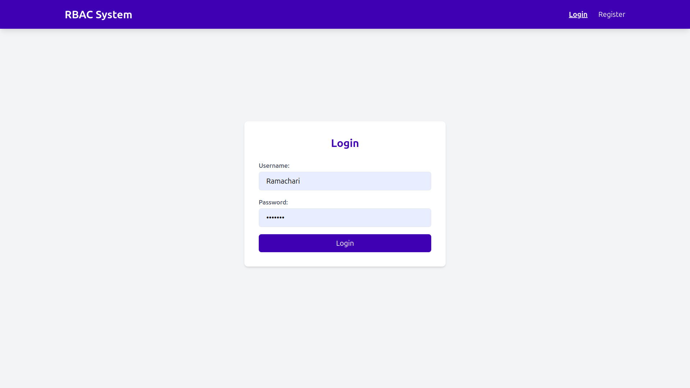
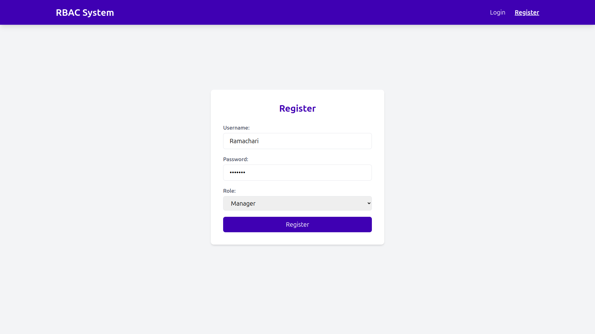
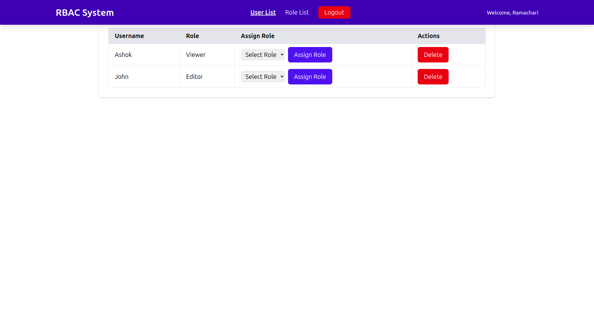
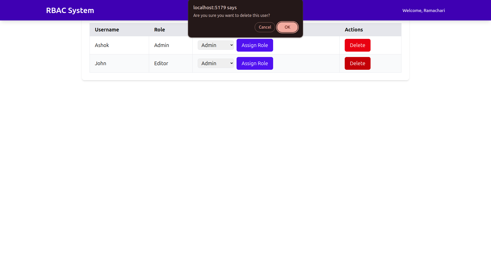
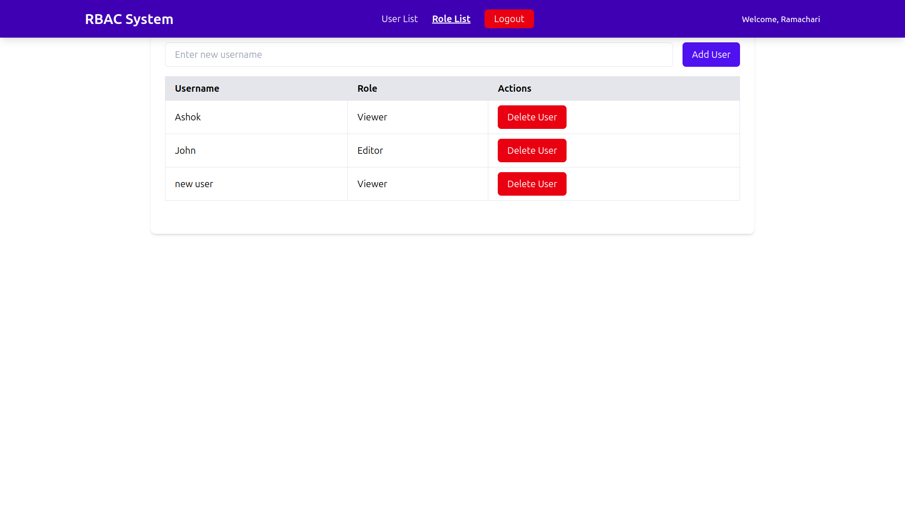

# RBAC (Role-Based Access Control) Assignment


# Overview

This project demonstrates a Role-Based Access Control (RBAC) system for managing users and their assigned roles. It is built using **React**, **Node.js (Express)**, **MongoDB**, **Vite**, and **Tailwind CSS**.


# Login


# Register



# User List



# User List Delete



# Role List




## Technologies Used

- **Frontend**:
  - **React**: A JavaScript library for building user interfaces.
  - **Vite**: A fast build tool and development server for modern web applications.
  - **Tailwind CSS**: A utility-first CSS framework for styling the frontend.
  - **React Router**: For client-side routing and navigation.
  - **Axios**: For making HTTP requests to the backend API.

- **Backend**:
  - **Node.js** (with **Express**): Backend framework for building the API.
  - **MongoDB**: NoSQL database for storing user data and roles.
  - **bcryptjs**: For hashing and verifying passwords.
  - **jsonwebtoken**: For handling JSON Web Tokens (JWT) for authentication.
  - **cors**: For enabling Cross-Origin Resource Sharing.

- **Development**:
  - **Nodemon**: A development utility to automatically restart the server during code changes.

## Installation

To set up and run the project locally, follow these steps:

### 1. Clone the repository

```bash
git clone git@github.com:amansh-tty/VRV-assignment.git
cd VRV-assignment
```

### 2. Install all the dependencies in Frontend Folder
Frontend Dependencies
```bash 
npm install axios prop-types react react-dom react-router-dom

```
Frontend dev dependencies
```bash
npm install @eslint/js @types/react @types/react-dom @vitejs/plugin-react autoprefixer eslint eslint-plugin-react eslint-plugin-react-hooks eslint-plugin-react-refresh globals postcss tailwindcss vite

```

### 3. Install all the dependencies in Backend Folder
Backend Dependencies
```bash
npm install bcryptjs cors dotenv express jsonwebtoken mongoose

```
Backend dev dependencies
```bash
npm install nodemon --save-dev

```
### 4. Run the frontend folder 

```bash
npm run dev
```

### 5. Run the Backend folder

```bash
npm run dev
```

